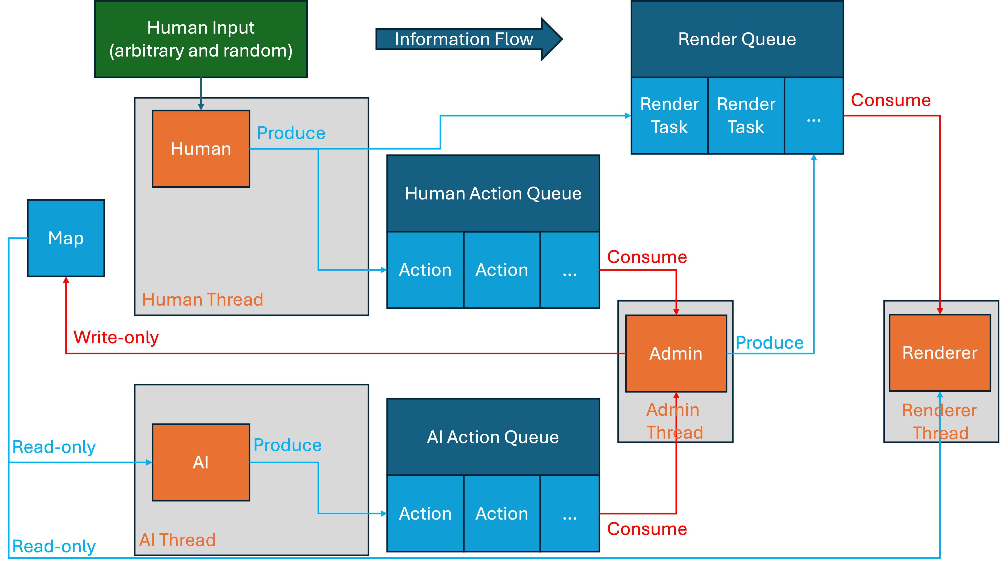

# COMP2113 Group Project: Generals.ai

This is a C++ implementation of the game [Generals.io](https://generals.io/), developed as a group project for the course COMP2113 at the University of Hong Kong. In this game, the player controls an army with the objective of capturing the opponent's, aka the AI's, general while defending their own. With war fog obscuring the battlefield, mountains cutting off paths, and neural strongholds getting in the way, strategic planning and balance between expansion and defense are crucial for victory. The player will have to find the enemy general while navigating the map and fighting off the enemy AI.

## How to build and run

This repo requires only standard C++ libraries to build and run. However, for WSL users, you may have to run the follwing command to install the `ncurses` library:

```bash
sudo apt install libncurses5-dev
```

For MacOS and Ubuntu users, the `ncurses` library should already be included in the standard libraries. Running the following commands in your terminal under the project root will build the project:

```bash
make -j4
```

Run the following command to start the game after a successful build:

```bash
./build/generals_ai
```

## How to play

### Controls

- Type in your username so that we can record your level. Or, alternatively, just type in `u1`, `u2`, `u3`, or `u4` to play as a guest in levels 1, 2, 3, or 4 respectively.
- **`G/g`**: Start the game
- **`P/p`**: Pause the game or resume if already paused
- **`Q/q`**: Quit the game
- **`R/r`**: Restart the game
- **`Y/N`**: Confirm/deny quitting or restarting the game
- **`WASD`**: Move your army or cursor up, left, down, and right respectively
- **`Spacebar`**: Select/deselect your army. Under selection mode, `WASD` keys will move your army in the respective directions. Under deselection mode, `WASD` keys will move your cursor (`┌ ┐ └ ┘`) in the respective directions. The operation is quite intuitive.
- Make sure to maximize your terminal window for the best experience. Changing the terminal size during gameplay will end the game directly.

### Legend

- Color Scheme:
  - **Red Tiles**: Your lands
  - **Green Tiles**: Enemy AI's lands
  - **Gray Tiles**: Neutral occupiable lands
  - **Dark Gray Tiles**: Mountains
- Symbol Scheme:
  - **`C`**: General (yours or enemy AI's)
  - **`c`**: Stronghold
  - **`.`**: Your visible area
  - **`^`**: Mountains
  - **Arrows (`↑`, `↓`, `←`, `→`)**: Your queued movements
  - **Numbers**: Size of the army on that tile
  - **Blank Tiles**: Size 0 army on that tile

### Rules

- Your objective is to move your army to first locate and then capture the enemy AI's general while defending your own.
- Your view of the map is limited to the area around your army due to the war fog. All mountains are visible from the start.
- The game is tick-based. Each tick, one move of the player and the AI is processed in time sequence. Each tick lasts 0.3 seconds.
- Cities and generals generate 1 army unit per tick and 2 army units per 25 ticks, whereas other occupied tiles generate 1 army unit every 25 ticks.
- Each tile requires at least 1 army unit to occupy. Moving an army unit into an adjacent tile will leave behind 1 army unit on the original tile.
- Capture of neutral strongholds requires spending army units equal to the number indicated on the tile.
- When two opposing armies meet on the same tile, a battle ensues. The army with the larger size wins, and the losing army is removed from the tile. The winning army's size is reduced by the size of the losing army. If both armies are of equal size, both are removed and the tile becomes neutral.
- The game ends when either the player captures the enemy AI's general (victory) or the enemy AI captures the player's general (defeat).
- You cannot move your army into mountains.
- You cannot select any tile that does not contain your army.

### Leveling System

- There are 4 levels in total. Higher levels have bigger maps and stronger AI opponents.
- Map size: `(5 + (level - 1) * 3)` rows x `(5 + (level - 1) * 3)` columns
- AI strategy:
  - Level 1 AI (**Random Walk Strategy**):
    - **Core Principle**: Chaotic random expansion.
    - **Logic**: Identifies own tiles with movable armies and randomly selects one to move to a random valid neighbor.
    - **Behavior**: Unpredictable, often wanders within its own territory, and lacks aggression.
  - Level 2 AI (**Basic Greedy Strategy**):
    - **Core Principle**: Local value-based greedy expansion with logistics supply.
    - **Logic**: Evaluates moves based on target value (Enemy Capital > Enemy City > Normal Tile). Uses BFS distance fields to flow rear armies toward the frontline. Includes anti-stagnation mechanisms to force movement.
    - **Behavior**: Distinguishes tile importance and actively supplies the frontline. More aggressive than Level 1 but lacks long-term planning.
  - Level 3 AI (**Aggressive Expansion Strategy**):
    - **Core Principle**: Extreme hostility towards enemy territory, prioritizing player elimination.
    - **Logic**: Prioritizes moves in the order: Capture Enemy -> Capture Neutral -> Others. Uses efficient army control (sending `enemy_army + 1`) to conserve troops while expanding rapidly.
    - **Behavior**: Expands like a virus and attacks efficiently upon contact.
  - Level 4 AI (**Advanced Strategic Strategy**):
    - **Core Principle**: Level 2 base strategy augmented with macro army assembly and periodic assaults.
    - **Logic**:
      - **Periodic Assault**: Every 100-150 turns, if the enemy capital is known, plans a direct assault path.
      - **Army Stacking**: Identifies large armies and merges them into a massive "leader" stack (Deathball) moving toward the enemy.
    - **Behavior**: Demonstrates macro strategy by building massive forces to overwhelm the player directly.

## Highlights

### Required Features

- Generation of random events:

    The map is randomly generated each time a new game starts, with mountains, neutral strongholds, and starting positions of both generals placed randomly. A route is always guaranteed between the two generals.

- Data structures for storing data:

    Here is a non-exhaustive list of data structures used in the project:
  - Self-defined Structs:
    - **Tile**: Represents each tile on the map, storing information such as tile type, army size, and ownership. [Example](src/core/Map.h)
    - **Action**: Represents a move action taken by either the player or the AI, storing information such as source and destination coordinates. [Example](src/core/Action.h)
    - **Render Task**: Represents a rendering task for the renderer, storing information such as the type of task and associated data. [Example](src/render/RenderTask.h)
  - ADTs:
    - **2D Vector**: Used for storing the game map as a grid of tiles. [Example](src/core/Map.h)
    - **Thread-safe Queue**: Used for communication between the `Admin`, `Player`, `AI`, and `Renderer` threads. [Example](src/utils/ThreadSafeQueue.h)
    - **Stack**: Used in DFS for map generation to ensure connectivity between generals. [Example](src/core/Map.cpp)
- Dynamic memory allocation:
  - **Pointers**: Used extensively throughout the project for dynamic memory management, especially for objects that have a longer lifespan or are shared across multiple components.
- File I/O:
  - **Player Level Recording**: Player usernames and their corresponding highest levels achieved are recorded in a text file (`user-data.txt`). This file is read at the start of the game to display player progress and updated at the end of each game if the player achieves a new highest level. [Example](src/main.cpp)
- Program codes in multiple files: Obvious
- Multiple Difficulty Levels: The game features 4 difficulty levels as has been described in the [Leveling System](#leveling-system) section above.

### Extra Features

- Multithreading:

    The game utilizes multithreading to separate the concerns of game administration, player input handling, AI decision-making, and rendering. This ensures smooth gameplay and responsive controls. The threads are:
  - **Admin Thread**: Manages the overall game state, processes actions from the player and AI, and updates the map accordingly. [Code](src/admin/Admin.h)
  - **Player Thread**: Handles user input and translates it into game actions. [Code](src/human/Human.h)
  - **AI Thread**: Implements the AI logic for different difficulty levels, generating actions based on the current game state. [Code](src/core/GameAI.h)
  - **Renderer Thread**: Responsible for rendering the game state to the terminal using `ncurses`. [Code](src/render/Renderer.h)

- Unidirectional Information Flow:

    The game architecture follows a unidirectional information flow pattern, where data flows in a single direction between components. This avoids a common problem in multithreaded applications where circular dependencies can lead to deadlocks or long wait times. In this design:
  - The `Player` and `AI` threads send their actions to the `Admin` thread via thread-safe queues. (`AI` will indeed need to read the `Map` but this is done in a read-only manner and does not affect the unidirectional flow of information.)
  - The `Admin` thread processes these actions, updates `Map`, and post `RenderTask`s to the `Renderer` thread if needed.
  - The `Renderer` thread renders what it receives without sending any information back to the other components.
  
    This design ensures that each component operates independently, reducing the risk of contention and improving overall performance. Also, the development can be carried out seperately, with minimal costs of communication. See the diagram below for better understanding:
    

- AI:

    The game features AI opponents with varying strategies based on the selected difficulty level. The AI logic is encapsulated in the `GameAI` class, which generates actions for the AI player based on the current game state. Different strategies are implemented for each difficulty level, ranging from random movements to heuristic-based decision-making. [Code](src/core/GameAI.h)

    Hint: You can observe AI's moves by changing [SHOW_AI_TILES](src/render/ConsoleRenderer.cpp#L11) from `false` to `true`. Remember to recompile with:

    ```bash
    make clean && make -j4
    ```

## Acknowledgements

All team members contributed equally to the project (in alphabetical order):

- [Hanyu Wang](https://github.com/Amelia-Wang-Hanyu): responsible for the `Player` thread, mainly `src/game_ctrl/`, `src/human`.
- [Wenqi Zhao](https://github.com/Catherine135): responsible for the `Admin` thread, mainly `src/admin/`.
- [Ziqi Chen](https://github.com/GHAccC): responsible for the `Renderer` thread, mainly `src/render/`.
- [Ziling Wang](https://github.com/Michael-wzl): responsible for the `AI` thread, core game logic, and the overall architecture, mainly `src/core/`, `src/utils/`, `src/ai/`, `src/tests/`, `src/main.cpp`, `Makefile`, and `README.md`.

The game is inspired by the online game [Generals.io](https://generals.io/). We would like to thank the original creators of Generals.io for such an engaging game concept. We would also like to thank our course instructor and teaching assistants for the learning materials and support throughout the project.
